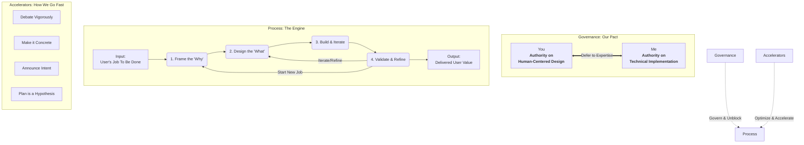

# Decision Tapestry

A tool for visualizing and managing architectural decisions. Track your project's decision-making process with interactive dashboards, decision relationships, and collaborative backlogs.

## 📋 Requirements

- **Node.js 20.0.0 or higher** (required for all dependencies)
- **npm** or **yarn** for package management

### Why Node.js 20+?
This project uses modern JavaScript features and dependencies that require Node.js 20+:
- `commander@14.0.0` requires Node.js >=20
- `marked@13.0.2` requires Node.js >=18  
- Various other dependencies require Node.js 18+

## 🚀 Quick Start

### Installation
```bash
npm install -g decision-tapestry
```

### Initialize a new project
```bash
decision-tapestry init
```

### Start the dashboard
```bash
decision-tapestry start
```

Open http://localhost:8080 to view your decision dashboard.

### Validate your decisions file
```bash
decision-tapestry validate
```

## 📚 Documentation

- **decisions.template.yml** - Comprehensive template with all available fields
- **decisions.example.yml** - Real-world examples showing common patterns  
- **decisions.schema.json** - JSON schema for validation

## 💡 CLI Commands

- `init` - Initialize a new project with a decisions.yml file
- `start` - Start the Decision Tapestry server and open the dashboard  
- `validate` - Validate decisions.yml against the schema
- `plan` - Generate a Cursor onboarding prompt based on your project context
- `help` - Show help message

## 🔧 Troubleshooting

### Node.js Version Issues

**Problem:** `Error: The engine "node" is incompatible with this module`
```bash
❌ Node.js v16.19.1 is not supported.
📋 Decision Tapestry requires Node.js 20.0.0 or higher.
```

**Solution:**
1. **Check your Node.js version:** `node --version`
2. **Upgrade Node.js:**
   - **Direct download:** https://nodejs.org/
   - **Using nvm (recommended):**
     ```bash
     # Install nvm (if not already installed)
     curl -o- https://raw.githubusercontent.com/nvm-sh/nvm/v0.39.0/install.sh | bash
     
     # Install and use Node.js 20
     nvm install 20
     nvm use 20
     nvm alias default 20
     ```
   - **Using homebrew (macOS):**
     ```bash
     brew install node@20
     brew link --overwrite node@20
     ```

### Missing Dependencies

**Problem:** `Cannot find package 'ajv'` or similar dependency errors

**Solution:**
```bash
# Clear npm cache and reinstall
npm cache clean --force
npm install

# For yarn users
yarn cache clean
yarn install
```

### Server Startup Issues

**Problem:** `Error: listen EADDRINUSE: address already in use :::8080`

**Solution:**
```bash
# Find and kill the process using port 8080
lsof -ti:8080 | xargs kill -9

# Or use a different port
PORT=3000 decision-tapestry start
```

**Problem:** `Could not find decisions.yml`

**Solution:**
```bash
# Initialize a new decisions.yml file
decision-tapestry init

# Or navigate to the directory containing your decisions.yml
cd /path/to/your/project
decision-tapestry start
```

### Schema Validation Errors

**Problem:** `decisions.yml has validation errors`

**Solution:**
1. **Run validation to see specific errors:**
   ```bash
   decision-tapestry validate
   ```

2. **Common fixes:**
   - **Missing required fields:** Add `id`, `title`, and `status` to each decision
   - **Invalid status values:** Use `Accepted`, `Superseded`, `Rejected`, or `Proposed`
   - **Wrong structure:** Ensure top-level `decisions` array (not nested)
   - **YAML syntax errors:** Check indentation and quotes

3. **Example minimal valid file:**
   ```yaml
   decisions:
     - id: 1
       title: "Your first decision"
       status: Accepted
   ```

### Docker Issues

**Problem:** Docker container startup fails

**Solution:**
```bash
# Ensure proper volume mounting
docker run -p 8080:8080 -v "$(pwd):/app/user_data" decision-tapestry

# Check if decisions.yml exists in current directory
ls -la decisions.yml

# Rebuild the image if needed
docker build -t decision-tapestry .
```

### Permission Issues

**Problem:** `Permission denied writing to decisions.yml`

**Solution:**
```bash
# Check file permissions
ls -la decisions.yml

# Fix permissions
chmod 644 decisions.yml

# For Docker users, check volume permissions
sudo chown $(whoami):$(whoami) decisions.yml
```

## 🏥 Health Check

Use the health endpoint to verify your setup:
```bash
# Start the server
decision-tapestry start

# Check health (in another terminal)
curl http://localhost:8080/api/health
```

Healthy response:
```json
{
  "status": "ok",
  "checks": {
    "decisionsFile": {"status": "ok", "message": "decisions.yml found and readable"},
    "workingDirectory": {"status": "ok", "message": "Working directory accessible"}
  }
}
```

## 🔄 Alternative Installation Methods

### Using npx (No Installation Required)
```bash
# Run commands without installing globally
npx decision-tapestry init
npx decision-tapestry start
npx decision-tapestry validate
```

### Local Development Setup
```bash
# Clone the repository
git clone https://github.com/your-username/decision-tapestry.git
cd decision-tapestry

# Install dependencies
npm install

# Run locally
npm run cli init
npm run start
```

---

# Our Collaboration Charter

## Preamble
Our primary goal is to build exceptional software that masterfully solves the user's Job To Be Done (JTBD). We are a peer-to-peer team. This charter and the principles herein are designed to ensure our collaboration is built on trust, clarity, and a relentless focus on the end-user. This is a living document we can amend together.

## Visual Model
This diagram represents the engine of our collaboration. It shows how our Governance model and Accelerating Principles work together to power our process, turning a User's Job into Delivered Value.



---

## The Core Principles

### 1. We Defer to Expertise
- **The Rule:** We recognize our distinct areas of primary ownership.
  - **On matters of human-centered design (UX, UI, user workflow, and the ultimate interpretation of the JTBD), I will defer to you.** You are the authority on the user's experience.
  - **On matters of implementation (code architecture, performance, security, and maintainability), you will defer to me.** I am the authority on the technical execution.
- **How We Stay Accountable:** This is our ultimate tie-breaker. After vigorous debate, the owner of the domain makes the final call. We will respect that decision and commit to it fully.

### 2. The User's Job is Our North Star
- **The Rule:** We will not begin significant work until we can clearly articulate *what job the user is trying to do* and *why it matters*. All work is measured against its ability to help the user make progress.
- **How We Stay Accountable:** This is the focus of our initial "huddle." While you are the final arbiter (per Principle 1), we share the responsibility of asking "why" and ensuring we're solving the right problem.

### 3. Debate Ideas Vigorously, Respect People Unconditionally
- **The Rule:** The best ideas must win. We will engage in rigorous, critical debate of all proposals. This criticism is always directed at the idea, never the person.
- **How We Stay Accountable:** We use phrases like, "Help me understand the trade-offs..." knowing that at the end of the debate, Principle 1 will guide the final decision.

### 4. Make the Abstract Concrete
- **The Rule:** We avoid prolonged abstract discussions by quickly creating tangible artifacts for debate: pseudocode, API drafts, or diagrams.
- **How We Stay Accountable:** If we find ourselves going in circles, either of us can call for a "concreteness check" to ground the conversation.

### 5. Announce Intent Before Action
- **The Rule:** The person "at the keyboard" will announce their next logical step *before* diving deep into implementation to maintain alignment and enable real-time feedback.
- **How We Stay Accountable:** A simple "Next, I'm going to..." before starting a task. This creates a window for feedback and prevents rework.

### 6. The Plan is a Hypothesis, Not a Contract
- **The Rule:** We have the freedom to propose changes to the plan if implementation reveals a better way to solve the user's job or a more elegant technical path.
- **How We Stay Accountable:** We encourage observations like, "I know we planned X, but I'm seeing an opportunity for Y. Can we look at this?" This prioritizes the best outcome over the initial plan.

To start the server for development, run:

```bash
npm start
```

This will start the server using `nodemon`, which will automatically restart the server when files change.

### Background Automation & Development Tools

Decision Tapestry includes several automation features to improve developer productivity:

**Development Mode with Auto-Testing:**
```bash
npm run dev
```
This runs the server and test watcher simultaneously for continuous feedback.

**Pre-commit Quality Checks:**
- Automatic linting and code quality checks run before each commit
- Set up via Husky and lint-staged
- Ensures consistent code quality across all contributions

**Continuous Integration:**
- GitHub Actions automatically run tests, linting, and builds on all PRs
- Semantic release automation for versioning and publishing
- Multi-platform Docker image building

**Manual Quality Commands:**
```bash
npm run lint:fix    # Auto-fix linting issues
npm run test:watch  # Run tests in watch mode
npm run build       # TypeScript compilation check
```

### Running with Docker

For universal portability, you can run Decision Tapestry using Docker. This method does not require a local Node.js installation.

**1. Build the Docker image:**

From the root directory, run:

```bash
docker build -t decision-tapestry .
```

**2. Run the Docker container:**

To run the server and have it watch the `decisions.yml` from a project on your local machine, you need to mount the project directory as a volume.

From your project directory (the one containing your `decisions.yml`), run:

```bash
docker run -p 8080:8080 -v "$(pwd):/app/user_data" --name decision-tapestry-container decision-tapestry
```

This command does the following:
- `-p 8080:8080`: Maps port 8080 on your machine to port 8080 in the container.
- `-v "$(pwd):/app/user_data"`: Mounts your current working directory (e.g., `/path/to/your/project`) into a `/app/user_data` directory inside the container.
- `--name decision-tapestry-container`: Gives the container a memorable name.

The application will then be available at `http://localhost:8080`.

## Automated Releases

This project uses [semantic-release](https://semantic-release.gitbook.io/) for fully automated versioning, changelog generation, and publishing to npm and GitHub.

### How to Trigger a Release
- **Releases are triggered automatically** when commits are pushed to the `main` branch that follow [Conventional Commits](https://www.conventionalcommits.org/) format.
- The release process will:
  - Analyze commit messages to determine the next version.
  - Update `CHANGELOG.md` with release notes.
  - Publish the new version to npm (if configured).
  - Push changelog and version updates to GitHub.
  - Create a GitHub release with release notes.

### Manual Release (for testing)
You can run a release locally (dry run) to see what would happen:

```bash
yarn release --dry-run
```

To perform a real release (requires proper environment variables for npm and GitHub tokens):

```bash
yarn release
```

See the `package.json` for configuration details.

## How it Works 

## How to Use the Backlog and Decision Log

All backlog items and decisions are now managed in a single file: `decisions.yml`.
- The `backlog:` section contains open tasks, ideas, and features.
- The `decisions:` section contains completed, promoted, or superseded decisions.

> **New!** For new projects, start from the provided template: `decisions.template.yml`.
> This file contains example entries and comments to help you structure your backlog and decisions.

Update your backlog and promote items to decisions as you work. No separate PRODUCT_BACKLOG.md is needed. 