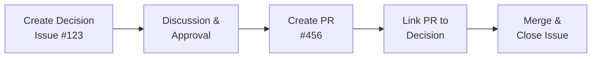

# Decision Tapestry: GitHub-Native Workflow

## Overview

Decision Tapestry can now run entirely on GitHub's infrastructure, using Issues as the storage backend and Projects v2 for organization. This eliminates the need for local `decisions.yml` files and provides a zero-friction integration with existing GitHub workflows.

## Benefits of GitHub-Native Approach

### 🚀 Zero Configuration

- No local files to maintain
- Works with any GitHub repository instantly
- Automatic version control through GitHub

### 🔄 Native Integration

- Decisions linked directly to PRs and commits
- Real-time updates via webhooks
- GitHub notifications for decision changes
- Integrated with GitHub search and filters

### 👥 Better Collaboration

- GitHub's built-in commenting system
- @mentions and team discussions
- Review workflows using labels
- Assignment and milestone tracking

### 📊 Enhanced Visibility

- GitHub Projects for kanban/table views
- Custom fields for decision metadata
- Automated workflows with GitHub Actions
- Cross-repository decision tracking

## Getting Started

### Option 1: GitHub App (Recommended)

1. **Install the Decision Tapestry GitHub App**

   ```bash
   # Visit: https://github.com/apps/decision-tapestry
   # Or create your own app using github-app-manifest.json
   ```

2. **Grant permissions to your repositories**
   - Issues: Read & Write
   - Pull Requests: Read
   - Projects: Admin

3. **Access the dashboard**
   ```
   https://decision-tapestry.app/[owner]/[repo]
   ```

### Option 2: Personal Access Token

1. **Create a GitHub Personal Access Token**
   - Go to Settings → Developer settings → Personal access tokens
   - Select scopes: `repo`, `project`

2. **Configure Decision Tapestry**

   ```bash
   export GITHUB_TOKEN=your_token_here
   export GITHUB_OWNER=your_org
   export GITHUB_REPO=your_repo

   decision-tapestry start --github
   ```

## Creating Decisions

### Using GitHub UI

1. **Create a new issue**
2. **Select "Architectural Decision" template**
3. **Fill in the structured fields**
4. **Add labels**: `decision`, `architecture`
5. **Optionally add to a Project**

### Using Decision Tapestry CLI

```bash
# Create a decision directly on GitHub
decision-tapestry create "Use React for frontend" --github

# With full details
decision-tapestry create "Migrate to TypeScript" \
  --rationale "Type safety improves code quality" \
  --tradeoffs "Learning curve for team" \
  --status proposed
```

### Decision Issue Format

The GitHub issue template provides these fields:

- **Title**: `[Decision] Your Decision Title`
- **Status**: Label-based (proposed, accepted, rejected, superseded)
- **Context**: Background information
- **Decision**: What we're doing
- **Rationale**: Why we chose this
- **Tradeoffs**: Pros and cons
- **Alternatives**: Other options considered
- **Consequences**: What this enables/requires
- **Affected Components**: Files/modules impacted
- **Implementation Tasks**: Checklist of work
- **Related Decisions**: Links to other decisions
- **Implementation PRs**: Links to PRs

## Organizing with GitHub Projects

### Create a Decision Board

1. **Create a new Project** in your repository
2. **Add custom fields**:
   - Status (single select): Proposed, Accepted, Rejected, Superseded
   - Priority (single select): High, Medium, Low
   - Impact (single select): Major, Minor, Patch
   - Category (single select): Architecture, Infrastructure, Process
   - Target Date (date field)
   - Risk Level (number 1-5)

3. **Create views**:
   - **Board view**: Group by Status
   - **Timeline view**: By Target Date
   - **Table view**: All fields visible
   - **Risk Matrix**: Group by Risk Level

### Automation with Projects

Add these automations to your project:

```yaml
# When issue is closed → Move to "Implemented"
# When "accepted" label added → Set Status to "Accepted"
# When PR is linked → Add to "In Progress"
```

## Migrating from decisions.yml

### Automated Migration

```bash
# Install migration tool
npm install -g decision-tapestry

# Run migration
decision-tapestry migrate-to-github

# Follow interactive prompts
# - Provide GitHub token
# - Select repository
# - Choose migration options
# - Review and confirm
```

### Manual Migration

If you prefer manual control:

1. Create issues for each decision
2. Use the decision template
3. Preserve decision IDs in issue title or body
4. Update references to use issue numbers

## Workflow Examples

### 1. Proposing a New Decision

```bash
# Developer proposes a decision
gh issue create --template decision.yml \
  --title "[Decision] Adopt GraphQL for API" \
  --label "decision,proposed"

# Team discusses in comments
# Architect approves
gh issue edit 123 --add-label "accepted"

# Link implementation PR
gh pr create --body "Implements #123"
```

### 2. Tracking Decision Implementation



### 3. Cross-Repository Decisions

```bash
# Search across all org repositories
gh api graphql -f query='
  query {
    search(query: "org:myorg label:decision", type: ISSUE, first: 100) {
      nodes {
        ... on Issue {
          repository { nameWithOwner }
          number
          title
          state
        }
      }
    }
  }'
```

## Dashboard Features

The Decision Tapestry dashboard now:

- **Reads directly from GitHub** (no local files)
- **Updates in real-time** via webhooks
- **Shows PR implementation status**
- **Displays decision timeline**
- **Links to GitHub for editing**
- **Supports GitHub search syntax**

### Accessing the Dashboard

```bash
# Start local dashboard
decision-tapestry dashboard --github

# Or use hosted version
open https://decision-tapestry.app/myorg/myrepo
```

## GitHub Actions Integration

### Auto-generate Decision Logs

```yaml
name: Update Decision Log
on:
  issues:
    types: [opened, closed, labeled]

jobs:
  update-log:
    runs-on: ubuntu-latest
    steps:
      - uses: decision-tapestry/update-log-action@v1
        with:
          github-token: ${{ secrets.GITHUB_TOKEN }}
          output-file: DECISIONS.md
```

### Enforce Decision Standards

```yaml
name: Validate Decision
on:
  issues:
    types: [opened, edited]

jobs:
  validate:
    runs-on: ubuntu-latest
    steps:
      - uses: decision-tapestry/validate-action@v1
        with:
          require-rationale: true
          require-alternatives: true
          min-tasks: 1
```

## Best Practices

### 1. Labeling Strategy

- `decision` - Required for all decisions
- `architecture` - Technical architecture decisions
- `proposed`, `accepted`, `rejected` - Status tracking
- `breaking-change` - Decisions requiring migration
- `security` - Security-related decisions

### 2. Linking Conventions

- Always reference decision issue in PR body: `Implements #123`
- Use task lists in decisions to track progress
- Link related decisions in issue body
- Tag stakeholders for review

### 3. Search Patterns

```bash
# Find all accepted decisions
label:decision label:accepted

# Find decisions by component
label:decision "frontend" in:body

# Find decisions needing implementation
label:decision label:accepted -linked:pr

# Find superseded decisions
label:decision label:superseded
```

## Comparison: Local vs GitHub

| Feature         | Local (decisions.yml) | GitHub Issues        |
| --------------- | --------------------- | -------------------- |
| Setup           | Required              | None                 |
| Storage         | Local file            | GitHub cloud         |
| Version Control | Git commits           | Automatic            |
| Collaboration   | PR-based              | Native GitHub        |
| Search          | Limited               | Full-text search     |
| Notifications   | None                  | GitHub notifications |
| API Access      | Custom                | GitHub API           |
| Offline Access  | Yes                   | Limited              |
| Cross-repo      | Manual                | Native               |

## Troubleshooting

### Common Issues

1. **Rate Limiting**
   - Use GitHub App instead of PAT
   - Implement caching in dashboard
   - Use webhook updates

2. **Permission Errors**
   - Ensure token has correct scopes
   - Check repository permissions
   - Verify issue template exists

3. **Migration Issues**
   - Check for duplicate issue numbers
   - Verify label permissions
   - Review rate limits

### Getting Help

- GitHub Issues: [github.com/govbarnesy/decision-tapestry/issues](https://github.com/govbarnesy/decision-tapestry/issues)
- Documentation: [decision-tapestry.app/docs](https://decision-tapestry.app/docs)
- Community: [github.com/govbarnesy/decision-tapestry/discussions](https://github.com/govbarnesy/decision-tapestry/discussions)

## Future Roadmap

- **GitHub Copilot integration** for decision suggestions
- **GitHub Insights** for decision impact analysis
- **Multi-org support** for enterprise deployments
- **Decision templates** marketplace
- **AI-powered decision analysis**
